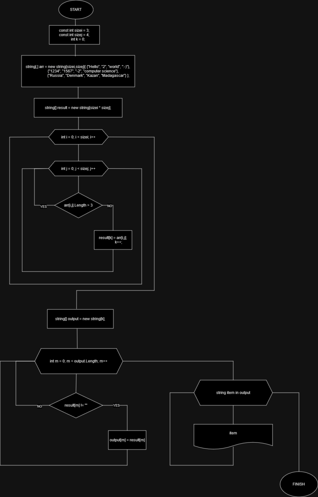

### Описание решения контрольной работы

#### Создаем 2D массив строк
```sh
    public static void Main(string[] args) {
        const int sizei = 3;
        const int sizej = 4;
        int k = 0;
        string[,] arr = new string[sizei,sizej]{ {"Hello", "2", "world", ":-)"},
                                         {"1234", "1567", "-2", "computer science"},
                                         {"Russia", "Denmark", "Kazan", "Madagascar"} };

```
#### Далее создаем новый пустой массив, куда запишем строки менее 3 символов
```sh
        string[] result = new string[sizei * sizej];

        for(int i = 0; i < sizei; i++) {
            for(int j = 0; j < sizej; j++) {
                if(arr[i,j].Length > 3)
                    continue;
                    else {
                        result[k] = arr[i,j];
                        k++;
                    }
            }
        }
    
```
#### Coздаем пустой массив, куда запшем только непустые строки
```sh
        string[] output = new string[k];

        for(int m = 0; m < output.Length; m++) {
            if(result[m] != "") {
                output[m] = result[m];
            }
        }

```
#### Вывод на печать
```sh
       Console.WriteLine("Массив из строк длиной <=3:");
        Console.Write("[");
        foreach(string item in output) {
            Console.Write($"\"{item}\", ");
        }
        Console.Write("]");
```
#### Блок-схема
